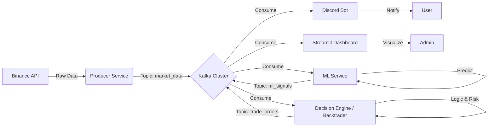

Chào bạn, với tư cách là một Senior AI Mentor & Python Expert, tôi đánh giá cao cấu trúc dự án hiện tại của nhóm. Các bạn đã có một nền tảng tốt: có luồng dữ liệu, có bot tương tác và có ý thức về model versioning.

Tuy nhiên, để nâng cấp lên mức độ đồ án tốt nghiệp chất lượng cao (CDIO) hoặc sản phẩm thực tế, chúng ta cần giải quyết bài toán về **tính ổn định, kiến trúc dữ liệu lớn (Big Data)** và **chiến lược giao dịch thực tế**.

Dưới đây là tư vấn chi tiết từng phần theo yêu cầu của bạn.

-----

### 1\. Nâng cấp Thuật toán Machine Learning (Chọn 3 từ danh sách 8)

Dựa trên danh sách 8 thuật toán bạn đưa ra (Hồi quy tuyến tính, Logistic, KNN, K-Mean, Random Forest, Bayes, Cây quyết định, SVM), đây là 3 lựa chọn tối ưu nhất cho dữ liệu chuỗi thời gian tài chính (Financial Time-series) đầy nhiễu động như Crypto:

#### **Lựa chọn 1: Random Forest (Rừng ngẫu nhiên)**

  * **Tại sao chọn:** Crypto có tính phi tuyến tính (non-linear) rất cao mà Hồi quy tuyến tính không bắt được. Random Forest là tập hợp của nhiều Decision Trees (Cây quyết định), giúp giảm thiểu vấn đề *overfitting* (quá khớp) thường gặp ở cây quyết định đơn lẻ. Nó cũng cho biết *feature importance* (yếu tố nào ảnh hưởng nhất đến giá: Volume hay MA?).
  * **Ứng dụng:** Dùng cho bài toán **Regression** (Dự đoán mức giá cụ thể) hoặc **Classification** (Dự đoán xu hướng Tăng/Giảm).
  * **Công thức:** Kết quả là trung bình (regression) hoặc đa số phiếu bầu (classification) của các cây con:
    $$\hat{y} = \frac{1}{B} \sum_{b=1}^{B} f_b(x)$$
    *(Với $B$ là số lượng cây, $f_b$ là kết quả của cây thứ $b$)*

#### **Lựa chọn 2: SVM (Support Vector Machine - Máy vector hỗ trợ)**

  * **Tại sao chọn:** SVM cực kỳ mạnh mẽ trong việc tìm ra ranh giới quyết định (decision boundary) trong không gian nhiều chiều. Trong trading, việc xác định "Trend" hay "No Trend" là bài toán phân lớp phức tạp. SVM (hoặc SVR cho hồi quy) hoạt động tốt hơn Linear Regression khi dữ liệu có nhiễu nhờ cơ chế *margin maximization*.
  * **Ứng dụng:** Dùng để phân loại **Buy Signal** (Tín hiệu mua) hay **Sell Signal** (Tín hiệu bán).
  * **Lưu ý:** Cần chuẩn hóa dữ liệu (Scaling) thật kỹ trước khi đưa vào SVM (MinMax hoặc Standard Scaler).

#### **Lựa chọn 3: Logistic Regression (Hồi quy Logistic)**

  * **Tại sao chọn:** Thay vì cố gắng dự đoán giá chính xác (rất khó), hãy dự đoán **xác suất** giá tăng hay giảm. Logistic Regression là thuật toán cơ bản nhưng hiệu quả nhất để làm "Baseline" cho bài toán phân loại nhị phân (Binary Classification). Nó nhẹ, train nhanh và dễ giải thích kết quả (White-box model).
  * **Ứng dụng:** Tính xác suất thị trường sẽ Tăng trong 1 giờ tới. Nếu $P(Up) > 0.7$ thì mới ra lệnh Mua.
    $$P(Y=1|X) = \frac{1}{1 + e^{-(\beta_0 + \beta_1X)}}$$

> **Lời khuyên của Mentor:** Hãy loại bỏ KNN (quá chậm khi dữ liệu lớn), K-Means (chỉ dùng để gom nhóm hành vi, không dự đoán được giá) và Linear Regression (quá đơn giản). Tập trung vào **Random Forest** làm model chính.

-----

### 2\. Hệ thống ra quyết định (Decision Making System)

Bạn không nên tự code lại từ đầu ("reinvent the wheel") một hệ thống khớp lệnh vì rất dễ sai sót logic tài chính. Hãy sử dụng các Framework mã nguồn mở (Open Source) đã được kiểm chứng.

**Đề xuất tối ưu:** **Freqtrade** hoặc **Backtrader**.
Tuy nhiên, để phù hợp với việc bạn muốn tích hợp Kafka và chạy Custom ML, tôi đề xuất kiến trúc **Hybrid** sử dụng **Backtrader**.

  * **Tên dự án:** `Backtrader` (Rất nổi tiếng trên GitHub).
  * **Tại sao chọn:**
    1.  Viết hoàn toàn bằng Python.
    2.  Cực kỳ linh hoạt để nhúng (inject) tín hiệu từ ML Model bên ngoài vào.
    3.  Hỗ trợ sẵn tính toán lãi/lỗ (PnL), phí giao dịch (Commission), trượt giá (Slippage).
    4.  Có thể chạy chế độ `Live` (kết nối sàn thật) hoặc `Paper Trading` (giả lập) dễ dàng.

**Quy trình Decision:**

1.  **Signal:** Model Random Forest dự đoán "Tăng".
2.  **Strategy (Backtrader):**
      * Kiểm tra ví tiền (Balance).
      * Kiểm tra rủi ro (Risk Management): Stoploss 2%, Take Profit 5%.
      * Kiểm tra chỉ báo phụ (RSI \< 70) để tránh mua đỉnh.
3.  **Action:** Gửi lệnh mua.

-----

### 3\. Giải pháp Demo & Dashboard Real-time (Sàn ảo)

Việc dùng sàn Testnet của Binance thường không ổn định. Để demo đồ án hoành tráng và kiểm soát được dữ liệu ("Show được toàn bộ kết quả từ dự đoán tới quyết định"), bạn nên **tự dựng một Dashboard chạy Local**.

**Công nghệ đề xuất:** **Streamlit** (Python).

**Mô tả hệ thống Demo:**

  * **Giao diện:** Chia làm 3 cột.
      * *Cột 1 (Dữ liệu):* Biểu đồ giá Real-time (vẽ bằng Plotly).
      * *Cột 2 (ML Brain):* Hiển thị log dự đoán (Ví dụ: "Random Forest: Tăng (80%)", "SVM: Giữ").
      * *Cột 3 (Execution):* Hiển thị trạng thái "Sàn ảo" (Số dư USDT, Lệnh đang mở, Lịch sử lãi/lỗ).
  * **Cơ chế khớp lệnh ảo:** Bạn viết một Class `VirtualExchange` đơn giản. Khi nhận lệnh "BUY" từ hệ thống Decision, nó sẽ ghi lại giá hiện tại. Khi có lệnh "SELL", nó so sánh giá để tính lãi lỗ.

-----

### 4\. Kiến trúc Big Data với Apache Kafka (Điểm nhấn CDIO)

Đây là phần sẽ nâng tầm dự án của bạn. Kafka sẽ đóng vai trò là "xương sống" vận chuyển dữ liệu, giúp hệ thống không bị "treo" khi xử lý nặng.

**Kiến trúc đề xuất:**



#### Chi tiết các Topics trong Kafka:

1.  **`crypto.market_data`**: Chứa dữ liệu OHLCV (Open, High, Low, Close, Volume) real-time từ Binance.
2.  **`crypto.ml_signals`**: Chứa kết quả dự đoán.
      * Format JSON: `{"timestamp": 123456, "model": "RandomForest", "prediction": "UP", "confidence": 0.85}`
3.  **`crypto.orders`**: Chứa lệnh giao dịch.
      * Format JSON: `{"action": "BUY", "price": 68000, "amount": 0.1, "status": "FILLED"}`

-----

### 5\. Roadmap thực hiện & Code Snippet mẫu

Để tránh bug, hãy thực hiện theo thứ tự:

#### Bước 1: Setup Kafka (Sử dụng Docker)

Tạo file `docker-compose.yml` để chạy Kafka và Zookeeper.

#### Bước 2: Producer (Thay thế `data_collector`)

Gửi dữ liệu vào Kafka thay vì chỉ lưu file.

```python
from confluent_kafka import Producer
import json

def delivery_report(err, msg):
    if err is not None:
        print(f'Message delivery failed: {err}')
    else:
        print(f'Message delivered to {msg.topic()}')

p = Producer({'bootstrap.servers': 'localhost:9092'})

# Trong vòng lặp lấy giá từ Binance:
data = {'symbol': 'BTCUSDT', 'price': 68000, 'timestamp': ...}
p.produce('crypto.market_data', json.dumps(data).encode('utf-8'), callback=delivery_report)
p.flush()
```

#### Bước 3: ML Service (Consumer & Predictor)

Load model `RandomForest` đã train, lắng nghe Kafka, dự đoán và đẩy kết quả đi.

```python
# Load model (Lưu ý path từ project cũ)
# model = joblib.load('data/models_production/random_forest.pkl')

# Consumer loop
while True:
    msg = consumer.poll(1.0)
    if msg is None: continue
    
    data = json.loads(msg.value().decode('utf-8'))
    # Preprocessing data...
    # prediction = model.predict(features)
    
    # Gửi tín hiệu vào Kafka topic mới
    producer.produce('crypto.ml_signals', json.dumps({'pred': prediction}).encode('utf-8'))
```

#### Bước 4: Decision & Dashboard

Viết app Streamlit lắng nghe topic `crypto.ml_signals` và `crypto.market_data` để hiển thị.

### ⚠️ Các điểm rủi ro cần kiểm soát (Rà soát bug)

1.  **Data Leakage (Rò rỉ dữ liệu):** Khi train Random Forest, tuyệt đối không dùng dữ liệu tương lai (ví dụ: dùng giá đóng cửa 10h để dự đoán giá 9h). Hãy sử dụng `TimeSeriesSplit` khi validate mô hình.
2.  **Latency (Độ trễ):** Kafka rất nhanh, nhưng Python xử lý ML có thể chậm. Hãy đảm bảo model `predict` dưới 500ms. Nếu chậm hơn, bot sẽ vào lệnh sai giá.
3.  **Serialization:** Đảm bảo format JSON thống nhất giữa các khâu Producer và Consumer.
4.  **Token Management:** Như trong tài liệu đã cảnh báo, tuyệt đối dùng `.env` cho API Key, không hardcode.

### Tổng kết gợi ý hành động (Next Steps):

1.  **Train lại model:** Sử dụng **Random Forest** thay cho Linear Regression.
2.  **Cài đặt Kafka:** Dùng Docker để dựng môi trường local.
3.  **Xây dựng luồng:** Producer -\> Kafka -\> ML Consumer -\> Decision.
4.  **Dựng Dashboard:** Dùng Streamlit để demo việc mua bán trực quan.